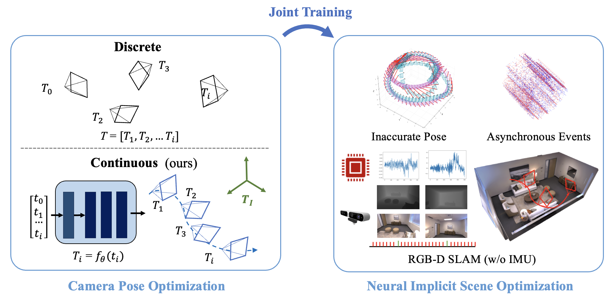
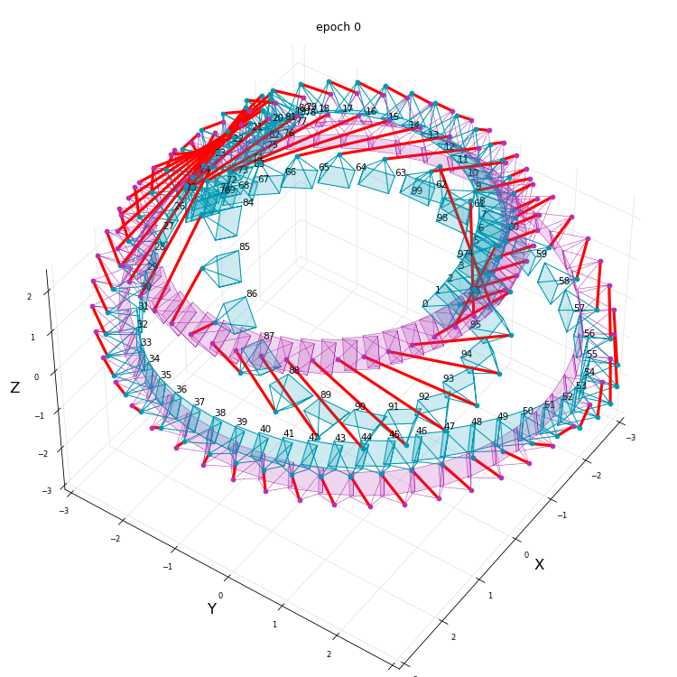
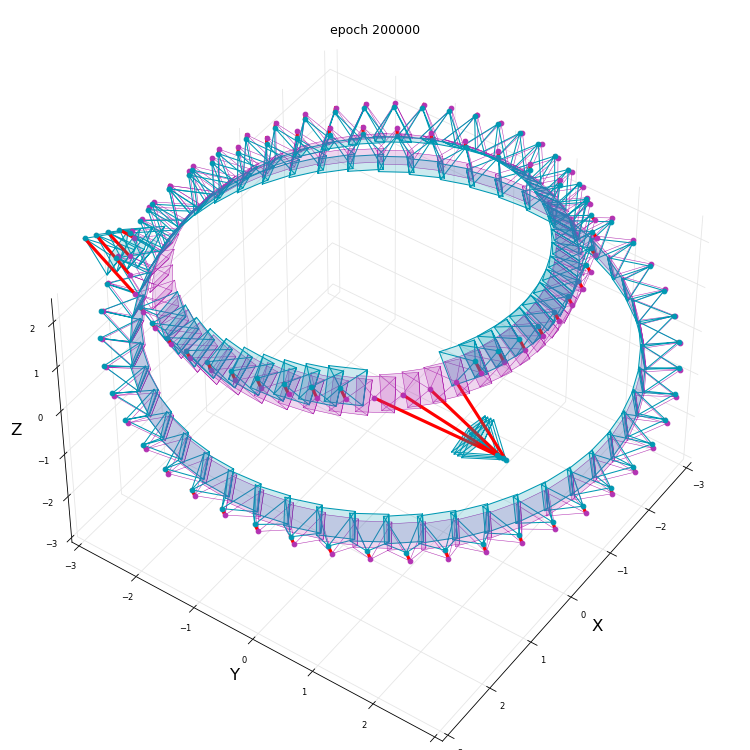
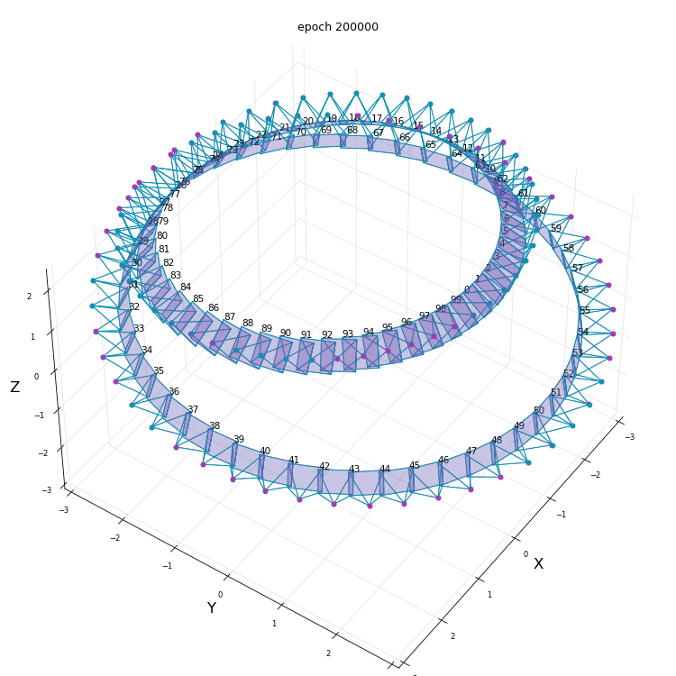
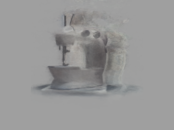
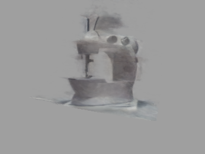
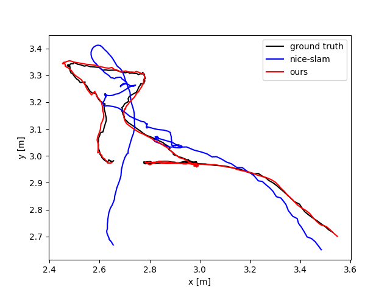
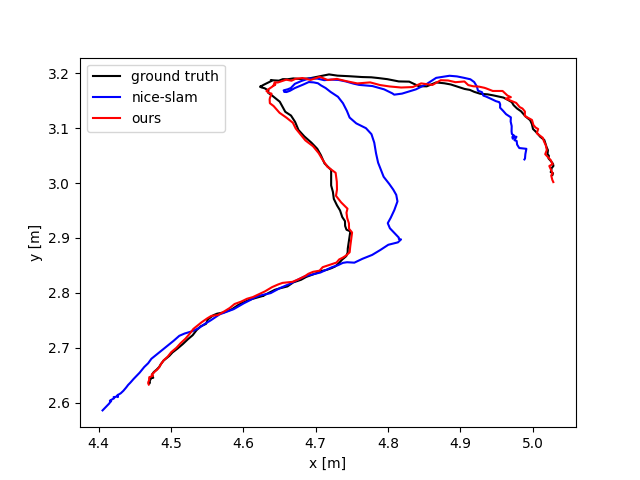

<h1 align="left">Continuous Pose for Monocular Cameras in Neural Implicit Representation
 <a href="https://arxiv.org/abs/2311.17119">.svg" ></a> </h1> 

<p align="center">
  <a href="#introduction">Introduction</a> |
  <a href="#results-demo">Results Demo</a> |
  <a href="#installation">Installation</a> |
  <a href="#quick-start">Quick Start</a> |
  <a href="#news">News</a> |
  <!-- <a href="#statement">Statement</a> |
  <a href="#reference">Reference</a> -->
</p>


## News
- [x] Upload demo code
- [x] Release code for showing how to implement on [Splatam!](https://github.com/qimaqi/SplaTAM_with_PoseNet)!

## Introduction

This repository contains the example code, test results for the paper Continuous Pose for Monocular Cameras in Neural Implicit Representation. It showcase the effectiveness of optimizing monocular camera poses as a continuous function of time with neural network.

We have released the demo code, more details will be released soon, please check news for details.

## Results-demo
We test our method on multiplte NeRF application, based on amazing code borrowed from [BARF](https://github.com/chenhsuanlin/bundle-adjusting-NeRF/tree/main), [EventNeRF](https://4dqv.mpi-inf.mpg.de/EventNeRF/) and [NICE-SLAM](https://github.com/cvg/nice-slam). 



We also plan to try it on more application like NeRFstudio, also welcome to give it shot on your application.

### Some of the results
BaRF results of initialize pose, BARF reuslts and our results





EventNeRF compare



NICE-SLAM compare




## Installation
Regarding the environment you need nothing but numpy, torch to make it work

## Quick start
You can check the code block in the bottom of PoseNet.py to get some idea of how it work. In short:
```python
from PoseNet import PoseNet 

# create a config dict
## if no imu is used, you can set min_time = 0 and max_time to number of images
## remember set activ to softplus if you calculate the derivatives
## max iterations is used to set scheduler
config = {
        'device': "cuda:0", 
        'poseNet_freq': 5,
        'layers_feat': [None,256,256,256,256,256,256,256,256],
        'skip': [4],  
        'min_time': 0,
        'max_time': 100,
        'activ': 'relu',
        'cam_lr': 1e-3,
        'use_scheduler': False
        'max_iter': 20000,
        }

# create instance
posenet = PoseNet(config)

# get a Nx3x4 pose matrix 
time = 1
est_pose = posenet.forward(time)

# add the step function after loss backward
loss.backward() # according to your implementation

posenet.step()

```

## Step by step implementation on how to use PoseNet in SLAM-Task

Since now the popularity in dense-slam is crazing and before I cleaned all messy code :(, I release a [tutorial](https://github.com/qimaqi/SplaTAM_with_PoseNet) on how to using PoseNet in [Splatam](https://github.com/spla-tam/SplaTAM) which is a famous Gaussian-splatting SLAM, simply using PoseNet can get results below:

| Method | Rel Pose Error| Pose Error| RMSE | PSNR |  
|-------|----------|----------|----------|----------|
| Splatam | 0.0011 | 0.0089 |   0.019  |  32.3667 |
| Splatam+Ours | 0.0002 | 0.0084 | 0.0031 | 37.0875 |


#### Detail tutorial
---
- Step 0:
 - Initialize the PoseNet, we basically just need the number of frames, if you do not know in your case, just put a large number here. If you want to small model, feel free to change the layers_feat
  ```python
    ##### create PoseNet 
    posenet_config = { 'n_img':num_frames , 
                    'tracking': {
                              "poseNet_freq": 5, 
                              "device": "cuda:0", 
                              "layers_feat": [None,256,256,256,256,256,256,256,256],
                              "skip": [4] }
                            }
    transNet = TransNet(posenet_config)
    transNet = transNet.to(device)
    rotsNet = RotsNet(posenet_config)
    rotsNet = rotsNet.to(device)

  ```

- Step 1:
  - Change the optimizer and parameter initialization, we modify the function ***initialize_optimizer()*** to make sure the PoseNet parameters will be passed to optimizer, moreover we set the ``` params['cam_unnorm_rots']``` and ```params['cam_trans'] ``` to ```requires_grad_(False)``` to avoid leaf tensor replacement issues. Note in mapping we change it back and this modificaton might be different based on your implementation in your slam-system.

  ```python
  def initialize_optimizer(params, lrs_dict, tracking, transNet=None, rotsNet=None):
    lrs = lrs_dict
    if tracking:
        if transNet is not None and rotsNet is not None:
            # we do not want to update cam_unnorm_rots=0.0004 and cam_trans=0.002,
            # but we want to update the weights of the networks
            params['cam_unnorm_rots'] = torch.nn.Parameter(params['cam_unnorm_rots'].cuda().float().contiguous().requires_grad_(False))
            params['cam_trans'] = torch.nn.Parameter(params['cam_trans'].cuda().float().contiguous().requires_grad_(False))
            param_groups = [{'params': [v for k, v in params.items() if k not in ["cam_unnorm_rots","cam_trans"]]}]
            param_groups.append({'params': transNet.parameters(), 'name': "transNet", 'lr': lrs['cam_trans']})
            param_groups.append({'params': rotsNet.parameters(), 'name': "rotsNet", 'lr': lrs['cam_unnorm_rots']})
            return torch.optim.Adam(param_groups)
        else:
            return torch.optim.Adam(param_groups)
    else:
        # in mapping we want to set cam_unnorm_rots to be differentiable agai  
        params['cam_unnorm_rots'] = torch.nn.Parameter(params['cam_unnorm_rots'].cuda().float().contiguous().requires_grad_(True))
        params['cam_trans'] = torch.nn.Parameter(params['cam_trans'].cuda().float().contiguous().requires_grad_(True))
        param_groups = [{'params': [v], 'name': k, 'lr': lrs[k]} for k, v in params.items()]
        return torch.optim.Adam(param_groups, lr=0.0, eps=1e-15)
  ```
---
- Step 2
  - We change the main loop, note that if you want to make the difference every timestep to be continuous, you need to set the ***forwarp_prop*** to False otherwise it already calculate the candidate pose with a const speed assumption.
  - We first save the last time pose:
    ```python
    if time_idx > 0:
      params = initialize_camera_pose(params, time_idx, forward_prop=config['tracking']['forward_prop'])
      current_cam_unnorm_rot_est = params['cam_unnorm_rots'][..., time_idx].detach().clone() 
      candidate_cam_tran_est = params['cam_trans'][..., time_idx].detach().clone() 
      current_cam_unnorm_rot_est_mat = rotation_conversions.quaternion_to_matrix(current_cam_unnorm_rot_est)
    ```
    By doing so after each optimization step we will multiple our new estimate pose on this. Note we convert quaternion to matrix but this is not necessary, you can directly do multiplication on quaternion since RotsNet output normalized quaternion

  - Last we calculate new pose estimation and put it back to ```params`
  ```python
  rots_delta_mat = rotation_conversions.quaternion_to_matrix(rots_delta)
  rots_new_est = torch.matmul(current_cam_unnorm_rot_est_mat, rots_delta_mat) 
  params['cam_unnorm_rots'] = params['cam_unnorm_rots'].clone().detach()
  params['cam_trans'] = params['cam_trans'].clone().detach()
  params['cam_unnorm_rots'][..., time_idx] =  rotation_conversions.matrix_to_quaternion(rots_new_est)
  params['cam_trans'][..., time_idx] = (candidate_cam_tran_est + trans_delta)

  ```
  We use ```params['cam_unnorm_rots'] = params['cam_unnorm_rots'].clone().detach()``` to avoid issues of visiting graph twice.

  --- 

That's it, by simply doing so we test on Replica room 0 and results we show on step 500, more results will coming out.


# TODOs
- [x] Upload demo code
- [x] Release code for showing how to implement on Splatam
- [ ] Release pip package (XD new user suspend)
- [ ] Release example on Nerfstudio
- [ ] Release mono-lego dataset
- [ ] Release code for replicate on BARF
- [ ] Release code for replicate on EventNeRF
- [ ] Release code for replicate on NICE-SLAM
- [ ] Make this page look nicer :)

